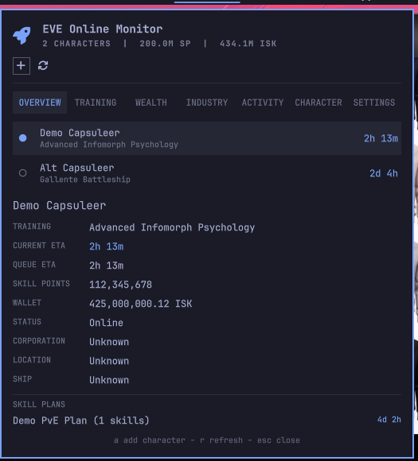

# EVE Online Monitor for Omarchy

Keep an eye on your capsuleers without leaving the Omarchy bar. EVE Online
Monitor puts skill queues, character details, and wallet activity into one
fast, keyboard-friendly popup for every character you authorize.



## Highlights

- Live skill-queue countdowns with current and total queue ETAs.
- Multi-character support with quick character switching.
- Overview, Training, Wealth, Industry, Activity, and Character views.
- Collapsible queues, skill categories, wallet panels, implants, clones,
  fatigue, standings, and loyalty sections.
- Wallet balance and 30-day cash-flow chart with income, expenses, and net.
- Local-time timestamps and readable EVE names for factions, corporations,
  stations, systems, and accessible structures.
- Local skill plans with prerequisite expansion and training-time estimates.
- Persistent ESI caching, safe error fallbacks, and a demo mode for previews.

The popup is deliberately focused on monitoring. It does not attempt to
replace the EVE client or manage your character in-game.

## Requirements

- Omarchy Quickshell (`omarchy-shell`)
- Python 3.10 or newer

The backend uses only Python's standard library. It does not install a daemon,
package, browser extension, or privileged service.

The plugin includes its public EVE client ID, so no local OAuth configuration
is required. Authorization uses this callback URL:

```text
http://127.0.0.1:48173/callback
```

Forks or development overrides can configure a different public client ID in:

```text
~/.config/omarchy-eve-monitor/config.json
```

Example override:

```json
{
  "client_id": "your-public-client-id",
  "redirect_uri": "http://127.0.0.1:48173/callback"
}
```

The client ID is public and is safe to keep in the plugin repository. Do not
put a client secret in this file or in the repository. Authorization uses OAuth
Authorization Code with PKCE. A fork using its own client ID must register the
same callback URL in its EVE developer application.

## Install

Install directly from the public repository:

```bash
omarchy plugin add https://github.com/Nicoolai/omarchy-eve-monitor.git --enable
omarchy bar move io.github.nicoolai.eve-monitor --section right
```

For local development from a checkout:

```bash
mkdir -p ~/.config/omarchy/plugins
cp -a /home/nicolai/src/omarchy-eve-monitor ~/.config/omarchy/plugins/io.github.nicoolai.eve-monitor
omarchy-shell shell rescanPlugins
omarchy plugin enable io.github.nicoolai.eve-monitor
omarchy bar move io.github.nicoolai.eve-monitor --section right
```

To remove the plugin:

```bash
omarchy plugin remove io.github.nicoolai.eve-monitor
```

## Use

- Left-click the bar widget to open the character dashboard.
- Right-click to authorize another character.
- Middle-click to refresh ESI data immediately.
- Press `a` in the panel to add a character.
- Press `r` in the panel to refresh.
- Select a character row to make it the selected bar character.
- Use `esc` to close the panel.

The detail views are loaded on demand:

- `Overview` shows queue status, skill points, wallet, location, ship, and
  saved plan ETAs.
- `Training` shows the active queue and categorized trained skills.
- `Wealth` shows wallet balance and recent cash flow.
- `Industry` combines industry jobs and market orders.
- `Activity` shows character notifications.
- `Character` shows implants, clones, fatigue, standings, and loyalty.

Click a section heading to expand or collapse it. The panel also supports
keyboard scrolling and keeps its scroll position while character details
refresh.

Configure the top-bar countdown with Omarchy's inline bar settings:

```bash
omarchy bar set io.github.nicoolai.eve-monitor barMode "Soonest active"
```

The available values are `Selected character`, `Soonest active`, and
`Automatic`. Settings are stored in `~/.config/omarchy/shell.json`.

With one character, the bar shows that character's current training time. By
default, `Selected character` follows the character chosen in the popup.
`Soonest active` always selects the shortest active training time. `Automatic`
follows the selected character with one character and uses the soonest active
completion with multiple characters. The popup always lists every character, and
the widget never creates one bar entry per character.

## Demo mode

Demo mode is safe for screenshots and UI development:

```bash
python3 bin/omarchy-eve-monitor demo on
omarchy-shell shell rescanPlugins
python3 bin/omarchy-eve-monitor snapshot
python3 bin/omarchy-eve-monitor demo off
```

The repository includes a root-level `preview.png` captured in demo mode for
the Omarchy plugin marketplace and GitHub visitors.

## Data and API behavior

Credentials are stored in `~/.config/omarchy-eve-monitor/state.json` with
private permissions. ESI responses are cached below
`$XDG_CACHE_HOME/omarchy-eve-monitor` and conditional requests use ETags and
Last-Modified headers. The widget refreshes no faster than the cache policy
allows and computes countdowns locally between API refreshes.

Authorization uses EVE Online SSO with OAuth PKCE. Press `a` in the popup to
authorize a character. The plugin requests ESI permissions for the data it
uses and performs no in-game write actions. Reauthorize existing characters
after a scope change if private structure names are needed; those require
`esi-universe.read_structures.v1` and docking access to the structure.

The ESI API exposes the current skill queue, not an EVEMon-style saved skill
plan. Saved plans will be local plugin data and will use ESI/SDE skill metadata
for prerequisites, attributes, implants, training estimates, and in-game skill
groups. Download the official skill catalog once before using plan estimates or
grouped trained skills:

```bash
python3 bin/omarchy-eve-monitor catalog-update
python3 bin/omarchy-eve-monitor plan-add "PvE Core" 3300 5
```

The Training tab shows the current skill queue followed by trained skills
grouped using EVE's in-game skill groups. The dashboard's detail tabs load on
demand. The same data can be inspected from
the backend for troubleshooting:

```bash
python3 bin/omarchy-eve-monitor details CHARACTER_ID skills
python3 bin/omarchy-eve-monitor details CHARACTER_ID wallet
```

The Wealth tab focuses on wallet balance and 30-day journal cash flow. Asset
browsing and transaction details are currently not shown in the panel.

Some ESI data is inherently limited: wallet journal data is limited to 30 days,
many histories are limited to 90 days, and skills may remain stale until the
character logs in. The panel will retain the last successful cache and show the
error instead of replacing useful data with an empty view.

## Development checks

```bash
python3 -m unittest discover -s tests -v
omarchy plugin validate .
qmllint -I "$OMARCHY_PATH/shell" BarWidget.qml Panel.qml
```

## License

MIT. See [LICENSE](LICENSE).
